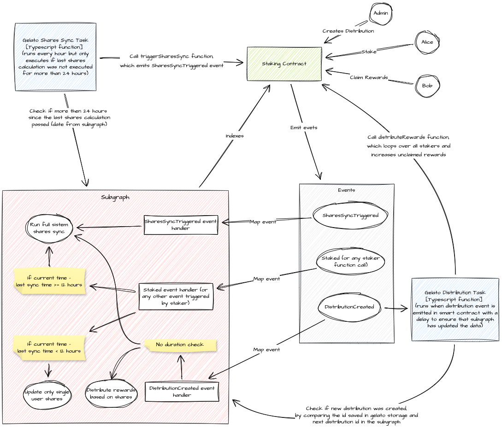

# Staking System Overview

## Terminology

### Staking Contract
This is the primary smart contract that maintains records of all pools, band levels, and user activities. It tracks the actions of users (stakers) such as staking, unstaking, upgrading, and downgrading. Additionally, it holds the funds for distributions.

### Staking Subgraph
This is the subgraph responsible for storing all data from the smart contract off-chain by indexing the staking contract. The subgraph has two primary functions within the system: calculating shares and computing reward distributions. These calculations are performed off-chain to minimize gas fees. The algorithms for these processes have been tested to ensure the integrity of the main logic. Additionally, the flexibility of the subgraph enables multiple redeployments to address any bugs that are discovered.

### Gelato Backend
This third-party service automates our transactions. Gelato is responsible for the architecture and performance of the entire backend service, which facilitates seamless integration with our smart contract and subgraph systems.

### Gelato Web3 (Typescript) Function
This is one of the automation types provided by Gelato. We opted for Typescript Functions over Solidity Functions because our business logic necessitates calling the subgraph to retrieve data. Gelato Functions allow for the selection from multiple trigger actions and configurations [Web3 Functions | Gelato Network](ttps://docs.gelato.network/web3-services/web3-functions)

### Distribution Task
This is the first Gelato Typescript Function we are implementing in our Staking System. The Distribution Task is activated when a `DistributionCreated` event is emitted. Following a brief delay - to ensure the subgraph has updated data - the backend retrieves the distribution details from the subgraph. It then interacts with the Staking Contract, executing the `distributeRewards` function with the necessary parameters.

### Shares Sync Task
This is the second Gelato Typescript Function deployed in our Staking System. The task is triggered hourly. Upon activation, the backend queries the subgraph to determine the time since the last shares synchronization. If approximately 24 hours have elapsed, the backend initiates a call to the Staking Contract's `triggerSharesSync` function. This function prompts the subgraph to calculate the shares.

## System flow diagram

## Shares Sync process

<b>Contract Data Management</b>: The contract stores all essential data, with the exception for shares. After multiple brainstorming sessions, we developed the current solution, which maximizes gas efficiency and optimizes fund distribution. The dynamic nature of shares, which change over time rather than in response to specific function calls, complicates their storage. Although the staking contract preserves details about bands, such as duration and type of staking, it does not calculate the number of shares held by stakers. To ensure that users see their up-to-date share amounts, synchronization occurs every 24 hours. We acknowledge that shares may not always reflect real-time values, but a 24-hour latency is deemed acceptable. This synchronization process unfolds in three distinct steps.

1. Trigger Shares Sync Task in gelato backend
    - Gelato Web3 Function Timing: This function is triggered hourly to determine if a shares synchronization is necessary.
    - Task Execution Process: When the task's `onRun` callback is triggered, several steps are systematically performed to ensure proper execution and response.
        - Initial Query Execution: The task's `onRun` callback initiates by querying our subgraph for the `stakingContractAddress` and the `lastSharesSyncDate`. The `stakingContractAddress` is then compared with the staking address from the task creation. If the addresses do not match, the execution is stopped. This check ensures that the subgraph has not been erroneously updated with a different address, preventing executions on outdated staking contracts.
    - Time Validation and Execution: Following the initial query, the `lastSharesSyncDate` is used to verify whether more than 23 hours and 50 minutes have elapsed. This specific duration is chosen to prevent a near miss where, at 23 hours, 59 minutes, and 59 seconds, the condition for exactly 24 hours would not be met, thus delaying the expected action to after 25 hours. If this and all other validations pass, the function call is encoded as calldata, ready for execution.
    - Handling Transaction Outcomes: When a transaction is successfully completed, the `onSuccess` callback is activated, and the transaction hash is logged for record-keeping. Conversely, if a transaction fails, the `onFail` callback is triggered, and the error details are logged to facilitate troubleshooting and analysis.

2. Call `triggerSharesSync` function in staking contracts
    - Function Trigger: This function is invoked by the Gelato executor.
    - Function Overview: This function is designed for minimal complexity. It does not alter any storage variables nor perform any calculations. Its sole operation is to emit the `SharesSyncTriggered` event.

3. Trigger `handleSharesSyncTriggered` mapping function in subgraph
    - Handler Overview: This handler straightforwardly updates the FLEXI (not FIXED) share amounts across all stakers, bands, and pools.

<b>Completion of Synchronization</b>: Following these three steps, the shares are synchronized, and users should be able to view their updated share amounts.

## Funds Distribution process

### Distribution Process Overview

The distribution process is the most complex in the system and involves five steps to ensure that rewards are distributed accurately. These steps are fully automated, alleviating the need for manual oversight. By simply calling the `createDistribution` function, the system autonomously manages all subsequent steps, ensuring a seamless operation.

1. Call `createDistribution` function in staking contracts
    - Usage of Distribution Function: This function should be invoked by the client or wallet that holds the distribution tokens. For the distribution process, it is only necessary to provide the token address (supporting USDT and USDC) and specify the amount in wei. Upon execution, the funds are transferred from the wallet to the smart contract.
    - Function Scope and Interaction with Subgraph: The function does not engage in any calculations related to shares or rewards; these tasks are handled entirely by the subgraph. To initiate these calculations within the subgraph, the function simply emits the `DistributionCreated` event.
2. Trigger `handleDistributionCreated` mapping function in subgraph
    - Subgraph Handler: In the subgraph, we index the `DistributionCreated` event to ensure that the `handleDistributionCreated` mapping function is triggered. This function performs four critical actions:
        - Initialization and ID Management: It creates a new distribution entity and updates the next distribution ID, which is essential for the operation of the Gelato task.
        - Calculation of FLEXI Band Shares: The function iterates through all users to update the shares for FLEXI bands, stakers, and pools. Shares for FIXED bands, which do not change, are already calculated during stake and unstake operations. Total shares calculations require looping through all pools.
        - Aggregation of Shares: It adds up the FLEXI band shares calculated in the previous step with the FIXED band shares for each user. The total shares calculation also necessitates iterating through all pools.
        - Reward Distribution: Based on the shares held, it calculates the proportionate rewards for distribution. Any small remaining token amounts (dust) that are undistributed pose minimal concern as they can be withdrawn by an admin from the contract.
3. Trigger Distribution Task in gelato backend
    - Post-Event Processing Delay: After a defined delay of approximately 100 blocks, or around 30 seconds (on the Arbitrum networks), it is expected that the subgraph has already indexed the `DistributionCreated` event and completed all necessary updates within the handler.
    - Function Trigger Specification: This function is exclusively triggered by the `DistributionCreated` event, with no other trigger options available for the currently active task.
    - Task Execution Process: When the task's `onRun` callback is activated, several specific steps are systematically performed to ensure proper execution and response.
        - Initial Query and Address Validation: The task's `onRun` callback starts by querying our subgraph for the `stakingContractAddress` and `nextDistributionId`. The stakingContractAddress is compared to the staking address from the task creation. If the addresses do not match, execution is stopped. This check ensures that the subgraph hasn’t been mistakenly updated with a different address, which could lead to executing calls on an outdated staking contract.
        - ID Verification and Update: We then retrieve the `nextDistributionId` from Gelato's storage. If the ID from the subgraph is greater than the one stored in Gelato, it confirms that a new distribution has indeed been created. Following this check, we either update the `nextDistributionId` in Gelato's storage or return false if no new distribution was created.
        - Second Query and Calldata Preparation: If all validations are successful, a second query to our subgraph is performed to fetch details such as token, rewards, and stakers from new distribution entity. These parameters are then encoded and returned as calldata, ensuring that Gelato executes and calls the distributeRewards function with these parameters.
        - Transaction Funding: Transactions on the mainnet are funded through the Gelato 1Balance service. 1Balance | Gelato Network 
    - Handling Transaction Outcomes: When a transaction is successfully completed, the `onSuccess` callback is activated, and the transaction hash is logged for record-keeping. Conversely, if a transaction fails, the `onFail` callback is triggered, and the error details are logged to facilitate troubleshooting and analysis.
4. Call `distributeRewards` function in staking contract
    - Function Trigger: This function is invoked by the Gelato executor.
    - Function Overview: This function, when called by the Gelato executor, performs several key operations. It loops through all stakers, updating the amount of unclaimed tokens for each. Additionally, it manages the `s_distributionInProgress` flag, which plays a critical role in system security by preventing users from performing any actions while the distribution process is underway and not yet completed. This flag can also be used as pause/unpause feature, useful in the event a critical bug is detected in the contract. At the conclusion of these updates, the function emits the `RewardsDistributed` event to trigger the corresponding handler in the subgraph.
    - Trigger `handleRewardsDistributed` mapping function in subgraph
    - Handler Overview: This handler primarily updates the unclaimed amounts for each band and staker. It utilizes the distribution entity that was previously created to minimize the number of requests to the staking contract.

<b>Completion of Distribution:</b> After completing these five steps, the funds are distributed, enabling users to claim their rewards.